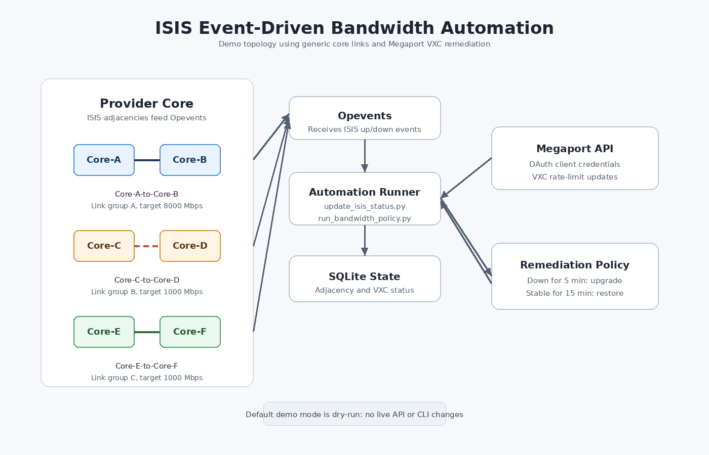

# ISIS Event-Driven Bandwidth Automation

A portfolio-ready network automation project that reacts to ISIS adjacency events and adjusts Megaport VXC bandwidth during major link degradation.

The original operational idea was simple: when important backbone adjacencies go down and stay down, temporarily increase cloud interconnect bandwidth; when the links are stable again, restore the normal baseline rate. This repository keeps that architecture but replaces private environment details with generic link names, sample data, fake product IDs, and a dry-run mode.



## Problem

Network teams often receive routing-adjacency events before users notice application impact. Those events can drive temporary remediation, but the workflow needs guardrails:

- Avoid reacting to short flaps.
- Avoid repeated API calls while the same outage is active.
- Restore baseline capacity after the network is stable.
- Leave an audit event for the automation action.
- Keep secrets, runtime state, and production identifiers outside source control.

## Solution Overview

This project models an event-driven remediation loop:

1. Opevents receives an ISIS adjacency event.
2. `src/update_isis_status.py` updates the local SQLite adjacency state.
3. `src/run_bandwidth_policy.py` evaluates configured link groups.
4. If any link in a group is down for at least 5 minutes, the policy raises the related Megaport VXC bandwidth.
5. If all links in a group are up and stable for at least 15 minutes, the policy restores the baseline bandwidth.
6. An Opevents audit event is created for every bandwidth action.

The default configuration is `dry_run: true`, so the demo prints intended Megaport and Opevents actions without changing live services.

## Architecture

The topology diagram is available as a rendered PNG at `docs/network-topology.png`, with an editable source version at `docs/network-topology.svg`.

```text
ISIS/Opevents event
        |
        v
update_isis_status.py
        |
        v
SQLite state store
        |
        v
run_bandwidth_policy.py
        |
        +--> Policy engine: down threshold / stable threshold
        |
        +--> Megaport API client: VXC rate-limit update
        |
        +--> Opevents client: audit event
```

## Repository Layout

```text
.
|-- config.example.yaml          # Generic link policy and dry-run config
|-- data/
|   |-- sample_adjacencies.csv   # Synthetic ISIS adjacency state
|   |-- sample_connections.csv   # Synthetic VXC mapping with fake UUIDs
|   `-- schema.sql               # SQLite schema
|-- src/
|   |-- init_demo_db.py          # Builds the sample SQLite database
|   |-- megaport_api.py          # Megaport OAuth/API wrapper
|   |-- opevents.py              # Opevents CLI wrapper
|   |-- policy.py                # Link-state decision logic
|   |-- run_bandwidth_policy.py  # Scheduler-friendly policy runner
|   |-- state_store.py           # SQLite persistence layer
|   `-- update_isis_status.py    # Event-to-state updater
|-- tests/
|   `-- test_policy.py
|-- .env.example
|-- .gitignore
|-- README.md
`-- requirements.txt
```

## Public-Safe Changes

The public version intentionally excludes private runtime material:

- No real API tokens are committed. Use `.env.example` as the placeholder template.
- No SQLite runtime database is committed. Build `data/demo_adjacency.db` from sample CSV files.
- No production paths are hardcoded in the application logic.
- Real connection names were replaced with `Core-A-to-Core-B`, `Core-C-to-Core-D`, and `Core-E-to-Core-F`.
- Real Megaport product UIDs were replaced with fake UUIDs.
- Discovery logs, backups, virtual environments, caches, and local databases are ignored by `.gitignore`.

## Quick Start

Create a virtual environment and install dependencies:

```bash
python3 -m venv .venv
source .venv/bin/activate
pip install -r requirements.txt
```

Create the demo database:

```bash
python src/init_demo_db.py
```

Run the policy engine in dry-run mode:

```bash
python src/run_bandwidth_policy.py --config config.example.yaml
```

Example dry-run output includes messages like:

```text
Core-A-to-Core-B: no bandwidth change required
DRY RUN: would set 00000000-0000-4000-8000-000000000002 to 1000 Mbps
DRY RUN: would run sudo /usr/local/omk/bin/opevents-cli.pl act=create-event ...
```

Update an adjacency from a simulated event:

```bash
python src/update_isis_status.py core-a core-b down 1779789300 --database data/demo_adjacency.db
```

Run the policy engine again to see the decision change based on the updated state.

## Configuration

`config.example.yaml` controls the project behavior:

```yaml
database_path: data/demo_adjacency.db
dry_run: true

policy:
  down_after_seconds: 300
  stable_after_seconds: 900
  baseline_bandwidth_mbps: 10

links:
  - name: Core-A-to-Core-B
    link_group: A
    upgrade_bandwidth_mbps: 8000
```

Use environment variables for credentials and endpoint overrides:

```bash
cp .env.example .env
```

Then fill in real values only in your local `.env` file:

```text
MEGAPORT_API_KEY=...
MEGAPORT_API_KEY_SECRET=...
OPEVENTS_CLI_PATH=/path/to/opevents-cli.pl
```

Keep `dry_run: true` while testing. Set it to `false` only in a controlled lab or approved environment.

## Testing

Run the policy tests:

```bash
pytest
```

The tests cover the core guardrails:

- A down link must pass the down threshold before upgrade.
- All links must be up and stable before restore.
- Baseline bandwidth is restored after stability.
- Repeated upgrades are avoided when already above baseline.

## Portfolio Notes

This project demonstrates practical NetDevOps patterns:

- Event-driven remediation from network telemetry.
- API integration with OAuth client credentials.
- Idempotent policy decisions backed by local state.
- Separation of config, secrets, data, and code.
- Dry-run-first automation for safe demos and reviews.

It is intentionally generic and safe for public review while preserving the original engineering idea: use routing events to trigger controlled, auditable bandwidth changes.
